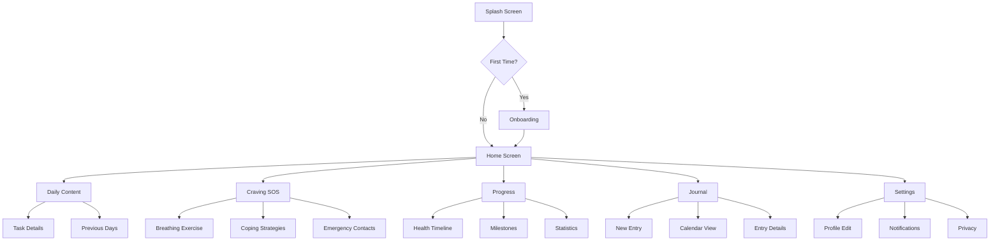

# Design Document

## Overview

৪১ দিনে ধূমপান ত্যাগ মোবাইল অ্যাপ্লিকেশন একটি React Native ভিত্তিক ক্রস-প্ল্যাটফর্ম মোবাইল অ্যাপ যা Android এবং iOS উভয় প্ল্যাটফর্মে কাজ করবে। অ্যাপটি সম্পূর্ণ বাংলা ভাষায় হবে এবং ইসলামী মূল্যবোধের উপর ভিত্তি করে ডিজাইন করা হবে।

### Technology Stack

- **Frontend Framework**: React Native (0.72+)
- **Language**: TypeScript
- **State Management**: React Context API + AsyncStorage
- **Navigation**: React Navigation 6
- **Local Database**: AsyncStorage / SQLite
- **UI Components**: React Native Paper (Material Design)
- **Notifications**: React Native Push Notification / Notifee
- **Date/Time**: date-fns / moment.js
- **Icons**: React Native Vector Icons
- **Animations**: React Native Reanimated

### Design Principles

1. **Simplicity First**: সহজ এবং স্বজ্ঞাত ইন্টারফেস
2. **Offline First**: সব মূল ফিচার অফলাইনে কাজ করবে
3. **Islamic Values**: ইসলামী থিম এবং কন্টেন্ট
4. **Performance**: দ্রুত লোডিং এবং মসৃণ অ্যানিমেশন
5. **Accessibility**: সব বয়সের ব্যবহারকারীদের জন্য উপযুক্ত

## Architecture

### High-Level Architecture

```
┌─────────────────────────────────────────────────┐
│           Presentation Layer (UI)               │
│  ┌──────────┐ ┌──────────┐ ┌──────────┐        │
│  │  Screens │ │Components│ │Navigation│        │
│  └──────────┘ └──────────┘ └──────────┘        │
└─────────────────────────────────────────────────┘
                      ↓
┌─────────────────────────────────────────────────┐
│          Business Logic Layer                   │
│  ┌──────────┐ ┌──────────┐ ┌──────────┐        │
│  │ Context  │ │  Hooks   │ │ Services │        │
│  └──────────┘ └──────────┘ └──────────┘        │
└─────────────────────────────────────────────────┘
                      ↓
┌─────────────────────────────────────────────────┐
│            Data Layer                           │
│  ┌──────────┐ ┌──────────┐ ┌──────────┐        │
│  │AsyncStore│ │  Models  │ │  Utils   │        │
│  └──────────┘ └──────────┘ └──────────┘        │
└─────────────────────────────────────────────────┘
```


### Folder Structure

```
src/
├── screens/              # All screen components
│   ├── OnboardingScreen.tsx
│   ├── HomeScreen.tsx
│   ├── DailyContentScreen.tsx
│   ├── CravingSOSScreen.tsx
│   ├── JournalScreen.tsx
│   ├── ProgressScreen.tsx
│   ├── SettingsScreen.tsx
│   └── MilestoneScreen.tsx
├── components/           # Reusable UI components
│   ├── common/
│   │   ├── Button.tsx
│   │   ├── Card.tsx
│   │   ├── Header.tsx
│   │   └── ProgressBar.tsx
│   ├── home/
│   │   ├── DayCounter.tsx
│   │   ├── MoneySaved.tsx
│   │   └── QuickActions.tsx
│   ├── daily/
│   │   ├── TaskList.tsx
│   │   ├── TaskItem.tsx
│   │   └── Affirmation.tsx
│   └── craving/
│       ├── BreathingExercise.tsx
│       ├── CopingStrategies.tsx
│       └── EmergencyContacts.tsx
├── navigation/           # Navigation configuration
│   ├── AppNavigator.tsx
│   └── navigationTypes.ts
├── context/              # Global state management
│   ├── UserContext.tsx
│   ├── ProgressContext.tsx
│   └── SettingsContext.tsx
├── services/             # Business logic services
│   ├── storageService.ts
│   ├── notificationService.ts
│   ├── prayerTimeService.ts
│   └── progressCalculator.ts
├── models/               # Data models and types
│   ├── User.ts
│   ├── DailyContent.ts
│   ├── JournalEntry.ts
│   └── Progress.ts
├── data/                 # Static content data
│   ├── dailyContent.ts   # 41 days content
│   ├── islamicContent.ts # Duas, dhikr, quotes
│   └── healthTimeline.ts # Health benefits timeline
├── utils/                # Utility functions
│   ├── dateUtils.ts
│   ├── calculators.ts
│   └── validators.ts
├── constants/            # App constants
│   ├── colors.ts
│   ├── strings.ts
│   └── config.ts
└── assets/               # Images, fonts, audio
    ├── images/
    ├── fonts/
    └── audio/
```

## Components and Interfaces

### Core Components

#### 1. HomeScreen Component
**Purpose**: Main dashboard showing progress and quick actions

**Key Features**:
- Day counter display
- Money saved calculator
- Quick access to SOS button
- Today's tasks summary
- Milestone progress bar
- Islamic greeting and daily affirmation

**Props**: None (uses context)

**State**:
```typescript
interface HomeScreenState {
  currentDay: number;
  moneySaved: number;
  todayTasks: Task[];
  completedTasks: number;
}
```

#### 2. DailyContentScreen Component
**Purpose**: Display day-specific content, tasks, and guidance

**Key Features**:
- Day title with emoji
- Detailed guidance text
- Task checklist with completion tracking
- Daily affirmations
- Navigation to previous days
- Islamic reminders

**Props**:
```typescript
interface DailyContentProps {
  dayNumber: number;
}
```

#### 3. CravingSOSScreen Component
**Purpose**: Emergency support for managing cravings

**Key Features**:
- Immediate coping strategies
- Guided breathing exercise with timer
- Islamic coping methods (dua, wudu reminder)
- Distraction activity suggestions
- Emergency contact quick dial
- Craving intensity logger

**State**:
```typescript
interface CravingSOSState {
  isBreathingActive: boolean;
  breathingPhase: 'inhale' | 'hold' | 'exhale';
  cravingIntensity: number;
  selectedStrategy: string;
}
```

#### 4. JournalScreen Component
**Purpose**: Daily journaling and trigger tracking

**Key Features**:
- Calendar view of entries
- Text input for daily notes
- Mood selector
- Trigger category selection
- Entry history view
- Search and filter capabilities

**Props**:
```typescript
interface JournalScreenProps {
  selectedDate?: Date;
}
```

#### 5. ProgressScreen Component
**Purpose**: Detailed progress visualization and statistics

**Key Features**:
- Timeline of health improvements
- Money saved breakdown
- Milestone badges display
- Craving frequency chart
- Trigger analysis
- Motivational statistics


## Data Models

### User Model

```typescript
interface User {
  id: string;
  quitDate: Date;
  dailyCigaretteCount: number;
  pricePerPack: number;
  cigarettesPerPack: number;
  prayerNotificationsEnabled: boolean;
  emergencyContacts: EmergencyContact[];
  createdAt: Date;
  updatedAt: Date;
}

interface EmergencyContact {
  id: string;
  name: string;
  phoneNumber: string;
  relationship: string;
}
```

### DailyContent Model

```typescript
interface DailyContent {
  day: number;
  title: string;
  emoji: string;
  introduction: string;
  tasks: Task[];
  affirmations: string[];
  guidance: string[];
  islamicReminders: string[];
  cravingTips: string[];
}

interface Task {
  id: string;
  description: string;
  isCompleted: boolean;
  category: 'preparation' | 'action' | 'reflection' | 'islamic';
}
```

### Progress Model

```typescript
interface Progress {
  userId: string;
  currentDay: number;
  smokeFreeHours: number;
  totalMoneySaved: number;
  milestonesAchieved: Milestone[];
  healthBenefits: HealthBenefit[];
  lastUpdated: Date;
}

interface Milestone {
  day: number;
  title: string;
  achievedDate: Date;
  badgeIcon: string;
}

interface HealthBenefit {
  timeframe: string;
  description: string;
  isAchieved: boolean;
  achievedDate?: Date;
}
```

### JournalEntry Model

```typescript
interface JournalEntry {
  id: string;
  userId: string;
  date: Date;
  content: string;
  mood: 'excellent' | 'good' | 'neutral' | 'difficult' | 'struggling';
  triggers: Trigger[];
  cravingCount: number;
  notes: string;
  createdAt: Date;
  updatedAt: Date;
}

interface Trigger {
  id: string;
  category: 'stress' | 'boredom' | 'social' | 'routine' | 'emotion' | 'other';
  description: string;
  intensity: number; // 1-10
  time: Date;
}
```

### Settings Model

```typescript
interface Settings {
  userId: string;
  language: 'bn';
  theme: 'light' | 'dark';
  fontSize: 'small' | 'medium' | 'large';
  notificationsEnabled: boolean;
  prayerTimesEnabled: boolean;
  dailyReminderTime: string; // HH:mm format
  soundEnabled: boolean;
  hapticEnabled: boolean;
  pinLockEnabled: boolean;
  pinCode?: string;
  location: {
    latitude: number;
    longitude: number;
    city: string;
  };
}
```

### IslamicContent Model

```typescript
interface IslamicContent {
  duas: Dua[];
  dhikr: Dhikr[];
  quotes: Quote[];
  verses: QuranVerse[];
}

interface Dua {
  id: string;
  title: string;
  arabic: string;
  bangla: string;
  transliteration: string;
  audioUrl?: string;
  category: 'craving' | 'gratitude' | 'strength' | 'forgiveness';
}

interface Dhikr {
  id: string;
  text: string;
  count: number;
  benefit: string;
  audioUrl?: string;
}

interface Quote {
  id: string;
  text: string;
  author: string;
  category: 'motivation' | 'health' | 'faith';
}

interface QuranVerse {
  id: string;
  surah: string;
  ayah: number;
  arabic: string;
  banglaTranslation: string;
  context: string;
}
```

## Services Architecture

### StorageService

**Purpose**: Handle all local data persistence

**Methods**:
```typescript
class StorageService {
  // User data
  async saveUser(user: User): Promise<void>
  async getUser(): Promise<User | null>
  async updateUser(updates: Partial<User>): Promise<void>
  
  // Progress data
  async saveProgress(progress: Progress): Promise<void>
  async getProgress(): Promise<Progress | null>
  async updateProgress(updates: Partial<Progress>): Promise<void>
  
  // Journal entries
  async saveJournalEntry(entry: JournalEntry): Promise<void>
  async getJournalEntries(startDate?: Date, endDate?: Date): Promise<JournalEntry[]>
  async updateJournalEntry(id: string, updates: Partial<JournalEntry>): Promise<void>
  async deleteJournalEntry(id: string): Promise<void>
  
  // Task completion
  async saveTaskCompletion(day: number, taskId: string, completed: boolean): Promise<void>
  async getTaskCompletions(day: number): Promise<Record<string, boolean>>
  
  // Settings
  async saveSettings(settings: Settings): Promise<void>
  async getSettings(): Promise<Settings | null>
  async updateSettings(updates: Partial<Settings>): Promise<void>
  
  // Data export/import
  async exportAllData(): Promise<string>
  async importData(data: string): Promise<void>
  async clearAllData(): Promise<void>
}
```

### NotificationService

**Purpose**: Manage all app notifications

**Methods**:
```typescript
class NotificationService {
  async requestPermission(): Promise<boolean>
  async scheduleDailyReminder(time: string): Promise<void>
  async schedulePrayerNotifications(times: PrayerTimes): Promise<void>
  async sendMotivationalNotification(message: string): Promise<void>
  async sendMilestoneNotification(milestone: Milestone): Promise<void>
  async cancelAllNotifications(): Promise<void>
  async cancelNotification(id: string): Promise<void>
}
```

### PrayerTimeService

**Purpose**: Calculate prayer times based on location

**Methods**:
```typescript
class PrayerTimeService {
  async getPrayerTimes(date: Date, latitude: number, longitude: number): Promise<PrayerTimes>
  async getNextPrayerTime(): Promise<{ name: string; time: Date }>
  async getCurrentLocation(): Promise<{ latitude: number; longitude: number }>
}

interface PrayerTimes {
  fajr: Date;
  dhuhr: Date;
  asr: Date;
  maghrib: Date;
  isha: Date;
}
```

### ProgressCalculator

**Purpose**: Calculate all progress-related metrics

**Methods**:
```typescript
class ProgressCalculator {
  calculateSmokeFreeTime(quitDate: Date): { days: number; hours: number; minutes: number }
  calculateMoneySaved(quitDate: Date, dailyCigarettes: number, pricePerPack: number): number
  calculateCigarettesNotSmoked(quitDate: Date, dailyCigarettes: number): number
  getHealthBenefits(smokeFreeHours: number): HealthBenefit[]
  getNextMilestone(currentDay: number): Milestone | null
  calculateProgressPercentage(currentDay: number): number
}
```


## User Interface Design

### Color Scheme (Islamic Theme)

```typescript
const colors = {
  primary: '#2E7D32',      // Islamic Green
  primaryLight: '#4CAF50',
  primaryDark: '#1B5E20',
  
  secondary: '#FFD700',    // Gold
  secondaryLight: '#FFE57F',
  
  background: '#F5F5F5',   // Light Gray
  surface: '#FFFFFF',
  
  text: {
    primary: '#212121',
    secondary: '#757575',
    disabled: '#BDBDBD',
  },
  
  success: '#4CAF50',
  warning: '#FF9800',
  error: '#F44336',
  info: '#2196F3',
  
  milestone: {
    bronze: '#CD7F32',
    silver: '#C0C0C0',
    gold: '#FFD700',
    diamond: '#B9F2FF',
  }
};
```

### Typography

```typescript
const typography = {
  fontFamily: {
    regular: 'NotoSansBengali-Regular',
    medium: 'NotoSansBengali-Medium',
    bold: 'NotoSansBengali-Bold',
  },
  
  fontSize: {
    small: {
      h1: 24,
      h2: 20,
      h3: 18,
      body: 14,
      caption: 12,
    },
    medium: {
      h1: 28,
      h2: 24,
      h3: 20,
      body: 16,
      caption: 14,
    },
    large: {
      h1: 32,
      h2: 28,
      h3: 24,
      body: 18,
      caption: 16,
    },
  },
};
```

### Screen Layouts

#### Home Screen Layout

```
┌─────────────────────────────────────┐
│  ☰  ৪১ দিনে ধূমপান ত্যাগ      🔔  │ Header
├─────────────────────────────────────┤
│                                     │
│  ┌───────────────────────────────┐ │
│  │   🎯 ধূমপানমুক্ত দিন: ১৫    │ │ Day Counter
│  │   💰 সঞ্চিত অর্থ: ৳২,২৫০    │ │ Card
│  └───────────────────────────────┘ │
│                                     │
│  ┌───────────────────────────────┐ │
│  │ 📅 আজকের দিন: দিন ১৫         │ │
│  │ অনুপ্রেরণা বজায় রাখা        │ │ Today's
│  │                               │ │ Content
│  │ ✓ অগ্রগতির প্রতিফলন          │ │ Preview
│  │ ☐ মাইলফলক উদযাপন            │ │
│  │ ☐ ধূমপান-মুক্ত ভবিষ্যৎ       │ │
│  └───────────────────────────────┘ │
│                                     │
│  ┌─────────────────────┐           │
│  │  🆘 লালসা মোকাবেলা  │           │ SOS Button
│  └─────────────────────┘           │
│                                     │
│  ┌───────────────────────────────┐ │
│  │ "আমি আল্লাহর সাহায্যে ধূমপান │ │ Daily
│  │  ত্যাগ করতে প্রতিশ্রুতিবদ্ধ" │ │ Affirmation
│  └───────────────────────────────┘ │
│                                     │
├─────────────────────────────────────┤
│  🏠  📅  📊  📔  ⚙️                 │ Bottom Nav
└─────────────────────────────────────┘
```

#### Daily Content Screen Layout

```
┌─────────────────────────────────────┐
│  ←  দিন ১৫: অনুপ্রেরণা বজায় রাখা  │ Header
├─────────────────────────────────────┤
│                                     │
│  💰 ১৫ তম থেকে ২১তম দিন           │ Title
│                                     │
│  এই পর্যায়ে এসে প্রত্যাহারের      │
│  লক্ষণগুলি কমে আসে, তবে অনুপ্রেরণা │ Introduction
│  বজায় রাখা জরুরী...               │
│                                     │
│  ━━━━━━━━━━━━━━━━━━━━━━━━━━━━━━━  │ Divider
│                                     │
│  📋 আজকের কাজ:                     │
│                                     │
│  ☑ অগ্রগতির প্রতিফলন              │
│    • আলহামদুলিল্লাহ বলুন          │ Task List
│    • সুবিধাগুলির তালিকা তৈরি করুন │ with
│                                     │ Checkboxes
│  ☐ মাইলফলক উদযাপন                 │
│    • শুকরিয়া আদায় করুন           │
│    • সদকা করুন                     │
│                                     │
│  ━━━━━━━━━━━━━━━━━━━━━━━━━━━━━━━  │
│                                     │
│  💬 নিশ্চিতকরণ:                    │
│  "আমি আল্লাহর সাহায্যে ধূমপান      │ Affirmations
│   ত্যাগ করতে প্রতিশ্রুতিবদ্ধ"     │
│                                     │
└─────────────────────────────────────┘
```

#### Craving SOS Screen Layout

```
┌─────────────────────────────────────┐
│  ←  লালসা মোকাবেলা                 │ Header
├─────────────────────────────────────┤
│                                     │
│  🆘 আপনি পারবেন!                   │
│  এই অনুভূতি ৩-৫ মিনিটে চলে যাবে   │ Encouragement
│                                     │
│  ━━━━━━━━━━━━━━━━━━━━━━━━━━━━━━━  │
│                                     │
│  🫁 শ্বাস-প্রশ্বাস ব্যায়াম         │
│                                     │
│  ┌───────────────────────────────┐ │
│  │         ⭕                     │ │ Breathing
│  │      শ্বাস নিন                │ │ Animation
│  │        4...                   │ │ Circle
│  └───────────────────────────────┘ │
│                                     │
│  ━━━━━━━━━━━━━━━━━━━━━━━━━━━━━━━  │
│                                     │
│  ⚡ দ্রুত সাহায্য:                  │
│                                     │
│  🤲 দোয়া পড়ুন                     │
│  💧 উযু করুন                        │ Quick
│  🚶 হাঁটতে যান                      │ Actions
│  💧 পানি পান করুন                  │
│  📞 কাউকে ফোন করুন                 │
│                                     │
│  ━━━━━━━━━━━━━━━━━━━━━━━━━━━━━━━  │
│                                     │
│  📝 লালসার তীব্রতা রেকর্ড করুন     │
│  ●○○○○○○○○○ (1/10)                │ Intensity
│                                     │ Slider
└─────────────────────────────────────┘
```

## Navigation Flow



## Error Handling

### Error Categories

1. **Storage Errors**: Failed to save/load data
2. **Permission Errors**: Notification or location permission denied
3. **Validation Errors**: Invalid user input
4. **System Errors**: Unexpected crashes

### Error Handling Strategy

```typescript
class ErrorHandler {
  static handle(error: Error, context: string): void {
    // Log error for debugging
    console.error(`[${context}]`, error);
    
    // Show user-friendly message
    if (error instanceof StorageError) {
      Alert.alert(
        'ডেটা সংরক্ষণ ব্যর্থ',
        'আপনার তথ্য সংরক্ষণ করতে সমস্যা হয়েছে। আবার চেষ্টা করুন।'
      );
    } else if (error instanceof PermissionError) {
      Alert.alert(
        'অনুমতি প্রয়োজন',
        'এই ফিচার ব্যবহার করতে অনুমতি দিন।'
      );
    } else {
      Alert.alert(
        'কিছু ভুল হয়েছে',
        'দয়া করে আবার চেষ্টা করুন।'
      );
    }
  }
}
```

## Testing Strategy

### Unit Testing
- Test all utility functions
- Test data models and validation
- Test calculation logic (money saved, progress, etc.)

### Integration Testing
- Test storage service operations
- Test notification scheduling
- Test prayer time calculations

### UI Testing
- Test navigation flows
- Test form inputs and validation
- Test task completion interactions

### Manual Testing Checklist
- [ ] Onboarding flow completion
- [ ] Daily content display for all 41 days
- [ ] Task completion and persistence
- [ ] Craving SOS features
- [ ] Journal entry creation and editing
- [ ] Progress calculations accuracy
- [ ] Notification delivery
- [ ] Settings changes persistence
- [ ] Offline functionality
- [ ] Data export/import

## Performance Optimization

### Strategies

1. **Lazy Loading**: Load daily content on demand
2. **Memoization**: Cache calculated values (money saved, progress)
3. **Image Optimization**: Use optimized images and icons
4. **List Virtualization**: Use FlatList for long lists
5. **Debouncing**: Debounce search and input operations
6. **Background Tasks**: Calculate progress in background

### Performance Targets

- App launch time: < 2 seconds
- Screen transition: < 300ms
- Task completion response: < 100ms
- Storage operations: < 500ms
- Memory usage: < 150MB

## Security Considerations

1. **Data Encryption**: Encrypt sensitive journal entries
2. **PIN Protection**: Optional PIN lock for app access
3. **Secure Storage**: Use secure storage for user data
4. **No External Tracking**: No analytics or tracking
5. **Local-First**: All data stored locally by default
6. **Data Export**: Allow user to export and delete all data

## Accessibility Features

1. **Font Scaling**: Support system font size settings
2. **High Contrast**: Ensure sufficient color contrast
3. **Screen Reader**: Support TalkBack/VoiceOver
4. **Touch Targets**: Minimum 44x44 dp touch targets
5. **Haptic Feedback**: Provide tactile feedback for actions
6. **Clear Labels**: All interactive elements have clear labels
